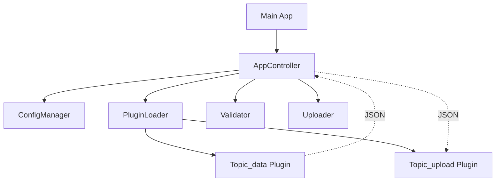

<div id="top" align="center">
<h1>c-gui</h1>

<p>Plugin-based Desktop-Client to collect data from different sources, validate and upload to SaaS</p>


[](https://github.com/Zheng-Bote/c-gui/releases)

[Report Issue](https://github.com/Zheng-Bote/c-gui/issues) · [Request Feature](https://github.com/Zheng-Bote/c-gui/pulls)
</div>

## Description


c-gui is a C++23 desktop application designed for secure data validation and upload to SaaS endpoints. It features a robust **Dual-Plugin Strategy** for flexible data input and output, and utilizes `libsodium` for hardware-accelerated encryption of configuration secrets.

## Features

- **Dual-Plugin Architecture**: Every data topic is handled by specialized Ingest (Input) and Upload (Output) plugins.
- **Dynamic Interface Discovery**: Automatically detects available data interfaces (CSV, JSON, XLSX, SQLite, Oracle, PostgreSQL, Kafka, S3-MFT) based on installed plugins.
- **Topic-Aware UI**: GUI dynamically adapts its data loading options and date format settings based on the selected topic and available plugins.
- **File Dialog Support**: Seamlessly browse for CSV, JSON, XLSX, and SQLite input files with pre-configured default path suggestions.
- **Configurable Upload Payloads**: Override plugin-specific upload options per topic via INI configuration.
- **Flexible Date Formatting**: Customize date component order and delimiters directly in the GUI.
- **Plugin Management**: Built-in dialog to inspect discovered plugins, their versions, and capabilities.
- **JSON Schema Validation**: Rigorous validation of incoming data against predefined schemas.
- **Secure Configuration**: INI files are encrypted on disk using XChaCha20-Poly1305 and Argon2id for password hashing.
- **Audit Log Signing**: Cryptographically sign critical audit logs using Ed25519 to ensure non-repudiation.
- **Global Proxy Support**: Centralized networking configuration with fallback support for all plugins and update checks.
- **Update Notifications**: Non-blocking check for new versions via asynchronous GitHub integration (v1.1.0).
- **Advanced Logging**: Real-time GUI status updates combined with persistent `spdlog` file rotation, OS user identification, and computer name audit trails.
- **Async Processing**: Background worker threads for validation and upload tasks to ensure a smooth UI experience.
- **Cross-platform**: Native support for Windows 11 and Linux.

## Prerequisites

- **C++23 Compiler**: GCC 13+, Clang 16+, or MSVC 19.36+.
- **CMake**: >= 3.28.
- **Conan**: v2.x.
- **wxWidgets**: 3.2+ (installed via Conan).
- **libsodium**: 1.0.18+ (installed via Conan).

## Build Instructions

1. **Install Dependencies**:

   ```bash
   conan install . --output-folder=build --build=missing
   ```

2. **Configure**:

2a. **Linux**

   ```bash
   cmake --preset conan-release
   ```

2b. **Windows**

```bash
   cmake --preset conan-default
```

3. **Build**

```bash
   cmake --build --preset conan-release -j 2
```

## Usage

### Encrypting Configuration

Before running the app, you need an encrypted configuration file. Use the `encrypt_tool`:

```bash
./build/src/encrypt_tool sample.ini config.enc "your_secure_password"
```

### Running the Application

Launch the main application and enter your password when prompted:

```bash
./build/src/c-gui
```

## Architecture

For a detailed architectural overview, including C4 models, please see the [Architecture Documentation](docs/architecture/architecture.md).

The project follows a modular architecture:

- **cgui_core**: Static library containing the business logic (Config, Plugins, Validation, Upload).
- **Plugins**: Shared libraries (`.so`/`.dll`) loaded at runtime. Every topic has a dual-plugin setup:
  - `<topic>_data`: Data ingestion (Input).
  - `<topic>_upload`: API integration (Output).
- **GUI**: wxWidgets-based front-end.



## Testing

Run unit tests using `ctest`:

```bash
cd build
ctest --output-on-failure
```

---

## 📄 Changelog

For a detailed history of changes, see the [CHANGELOG.md](CHANGELOG.md).

## 📜 License

This project is licensed under the  License - see the LICENSE file for details.

©️ Copyright (c) 2026 ZHENG Robert

## 👤 Author

[](https://www.github.com/Zheng-Bote)

### 🤝 Code Contributors

[](https://img.shields.io/github/contributors/Zheng-Bote/c-gui)

---

**Happy coding!** 🚀 🖖

<p align="right">(<a href="#top">back to top</a>)</p>
