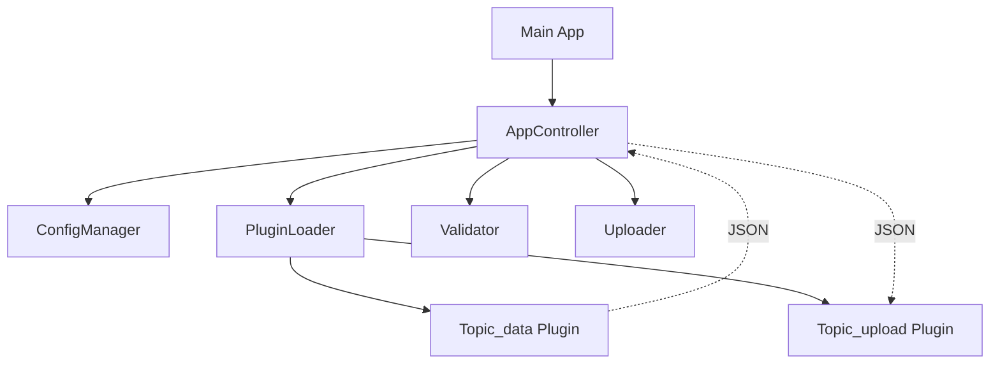

<div id="top" align="center">
<h1>c-gui</h1>

<p>Plugin-based Desktop-Client to collect data from different sources, validate and upload to SaaS</p>


[](https://github.com/Zheng-Bote/c-gui/releases)

[Report Issue](https://github.com/Zheng-Bote/c-gui/issues) · [Request Feature](https://github.com/Zheng-Bote/c-gui/pulls)
</div>

## Description


**c-gui** is a secure, high-performance C++23 desktop application designed for validating and uploading data to SaaS endpoints. It features a modern dual-plugin architecture that supports both native C++ modules and sandboxed WebAssembly (WASM) plugins for flexible data input and output, and utilizes `libsodium` for hardware-accelerated encryption of configuration secrets.

---

## 🚀 Key Features

- **Hybrid Plugin System**: Seamlessly load native shared libraries (`.dll`/`.so`) and WebAssembly modules (`.wasm`) using the integrated **Wasmtime** engine.
- **Secure by Design**:
  - Configuration encryption using **XChaCha20-Poly1305** and **Argon2id**.
  - Non-repudiation via **Ed25519-signed** audit logs.
  - Redaction of sensitive credentials from logs and UI updates.
- **Flexible Data Ingestion**:
  - Native support for CSV, JSON, XLSX, PostgreSQL, and Oracle (via SOCI).
  - WASM-based REST API ingestion with **Host-Assisted Networking** (libcurl bridge).
- **Modern UI**: Built with **wxWidgets**, featuring a responsive design, background worker threads, and integrated branding.
- **Robust Configuration**: Custom INI parser supporting unlimited line lengths and complex connection strings.

---

## 🛠️ Prerequisites

- **Compiler**: C++23 compatible (MSVC 19.36+, GCC 13+, Clang 17+)
- **Build Tools**: CMake 3.28+, Conan v2.x
- **WASM Development**: [Go](https://go.dev/) 1.21+ or [TinyGo](https://tinygo.org/) for building WASM plugins.
- **Oracle Instant Client**: (for Oracle support).

---

## 📦 Building and Running

### 1. Install Dependencies
```bash
conan install . --output-folder=build --build=missing
```

### 2. Configure & Build
```bash
# Windows (Visual Studio)
cmake --preset conan-default
cmake --build --preset conan-default -j

# Linux / Ninja
cmake --preset conan-release
cmake --build --preset conan-release -j
```

### 3. Setup Configuration
Generate an encrypted configuration file from a template:
```bash
./build/bin/encrypt_tool sample.ini config.enc "your_password"
```

> [!NOTE]
> for more secured handling, see [docs/encrypt_tool_readme.md](docs/encrypt_tool_readme.md)

### 4. Launch
```bash
./build/bin/c-gui
```

## Testing

Run unit tests using `ctest`:

```bash
cd build
ctest --output-on-failure
```

---

## 🧩 WebAssembly Plugins

The application now supports WASM plugins for safe and portable data ingestion.

- **Storage**: Place `.wasm` files in the `./plugins/data/` directory.
- **Capabilities**: Access host-side HTTP services and system trust stores via the `env` host module.
- **Examples**: See `plugins/location_rest-json_input_wasm` for a Go-based REST API plugin.

---

## Architecture

For a detailed architectural overview, including C4 models, please see the [Architecture Documentation](docs/architecture/architecture.md).

The project follows a modular architecture:

- **cgui_core**: Static library containing the business logic (Config, Plugins, Validation, Upload).
- **Plugins**: Shared libraries (`.so`/`.dll`) loaded at runtime. Every topic has a dual-plugin setup:
  - `<topic>_data`: Data ingestion (Input).
  - `<topic>_upload`: API integration (Output).
- **GUI**: wxWidgets-based front-end.



## 📜 Documentation

- [System Overview](docs/technical/01-overview.md)
- [Architecture Details](docs/architecture/architecture.md)
- [Plugin Development Guide](docs/technical/08-plugin-development-guide.md)
- [Security Architecture](docs/technical/05-security-architecture.md)
- [Changelog](CHANGELOG.md)

---

## ⚖️ License

Distributed under the **Apache-2.0 License**. See `LICENSE` and `NOTICE` for more information.

Copyright (c) 2026 ZHENG Robert (robert@hase-zheng.net)

## 👤 Author

[](https://www.github.com/Zheng-Bote)

### 🤝 Code Contributors

[](https://img.shields.io/github/contributors/Zheng-Bote/c-gui)

---

**Happy coding!** 🚀 🖖

<p align="right">(<a href="#top">back to top</a>)</p>
