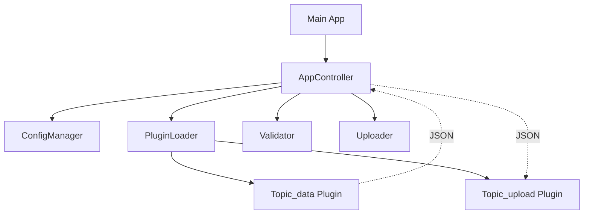

# c-gui

c-gui is a C++23 desktop application designed for secure data validation and upload to SaaS endpoints. It features a robust **Dual-Plugin Strategy** for flexible data input and output, and utilizes `libsodium` for hardware-accelerated encryption of configuration secrets.

## Features

- **Dual-Plugin Architecture**: Every data topic is handled by specialized Ingest (Input) and Upload (Output) plugins.
- **Dynamic Interface Discovery**: Automatically detects available data interfaces (CSV, PostgreSQL, Oracle, Kafka) based on installed plugins.
- **Topic-Aware UI**: GUI dynamically adapts its data loading options based on the selected topic and available plugins.
- **Plugin Management**: Built-in dialog to inspect discovered plugins, their versions, and capabilities.
- **JSON Schema Validation**: Rigorous validation of incoming data against predefined schemas.
- **Secure Configuration**: INI files are encrypted on disk using XChaCha20-Poly1305 and Argon2id for password hashing.
- **Update Notifications**: Automatic check for new versions via GitHub integration.
- **Advanced Logging**: Real-time GUI status updates combined with persistent `spdlog` file rotation and OS user audit trails.
- **Async Processing**: Background worker threads for validation and upload tasks to ensure a smooth UI experience.
- **Cross-platform**: Native support for Windows 11 and Linux.

## Prerequisites

- **C++23 Compiler**: GCC 13+, Clang 16+, or MSVC 19.36+.
- **CMake**: >= 3.28.
- **Conan**: v2.x.
- **wxWidgets**: 3.2+ (installed via Conan).
- **libsodium**: 1.0.18+ (installed via Conan).

## Build Instructions

1. **Install Dependencies**:

   ```bash
   conan install . --output-folder=build --build=missing
   ```

2. **Configure and Build**:
   ```bash
   cmake --preset conan-release
   cmake --build --preset conan-release -j"$(nproc)"
   ```

## Usage

### Encrypting Configuration

Before running the app, you need an encrypted configuration file. Use the `encrypt_tool`:

```bash
./build/src/encrypt_tool sample.ini config.enc "your_secure_password"
```

### Running the Application

Launch the main application and enter your password when prompted:

```bash
./build/src/c-gui
```

## Architecture

For a detailed architectural overview, including C4 models, please see the [Architecture Documentation](docs/architecture/architecture.md).

The project follows a modular architecture:

- **cgui_core**: Static library containing the business logic (Config, Plugins, Validation, Upload).
- **Plugins**: Shared libraries (`.so`/`.dll`) loaded at runtime. Every topic has a dual-plugin setup:
  - `<topic>_data`: Data ingestion (Input).
  - `<topic>_upload`: API integration (Output).
- **GUI**: wxWidgets-based front-end.



## Testing

Run unit tests using `ctest`:

```bash
cd build
ctest --output-on-failure
```

## License

Apache-2.0. See `LICENSE` and `NOTICE` for details.
