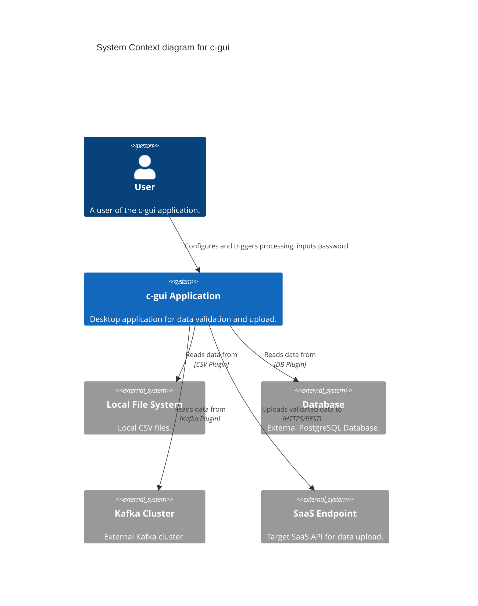
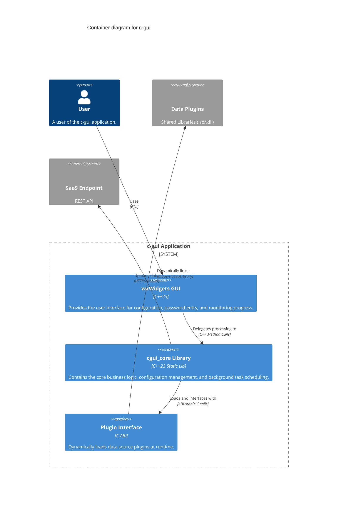
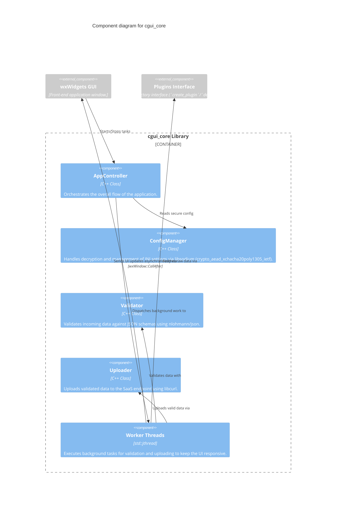

# c-gui Architecture Documentation

This document provides a comprehensive overview of the `c-gui` application architecture. It uses the [C4 model](https://c4model.com/) to describe the system at various levels of abstraction.

## Overview

`c-gui` is a modern C++23 desktop application designed for secure data validation and upload to SaaS endpoints. The application is built with a strong emphasis on security, modularity, and responsiveness.

**Key Technologies:**
- **Language:** C++23
- **GUI:** wxWidgets
- **Security:** libsodium (XChaCha20-Poly1305 for encryption)
- **Networking:** libcurl
- **Data Handling:** nlohmann/json
- **Plugin System:** ABI-stable C interface

---

## 1. Context Diagram

The Context diagram shows the `c-gui` application in its environment, illustrating its interactions with the user and external systems.

---

## 2. Container Diagram

The Container diagram breaks down the `c-gui` application into its major execution units (containers) and shows how they interact.

---

## 3. Component Diagram

The Component diagram zooms into the `cgui_core` library to show its internal structure and components.

---

## Key Architectural Decisions

### 1. Security First
- **No Plaintext Secrets:** Configuration files (`.ini`) containing API keys, database credentials, or SaaS endpoints are encrypted on disk using `libsodium`.
- **In-Memory Security:** The user is prompted for a master password at runtime. This password is used to decrypt the configuration into memory and is never persisted to disk.

### 2. Plugin-Based Data Extraction
- To support diverse and evolving data sources (e.g., flat files, SQL databases, message brokers like Kafka) without bloating the core application, data extraction is abstracted behind a plugin interface.
- Plugins are compiled as shared libraries (`.so` or `.dll`) and loaded at runtime. 
- The interface is defined using a pure C ABI (e.g., `create_plugin`, `destroy_plugin`) to ensure stability across different C++ compiler versions or standard libraries.

### 3. Responsive UI (Threading)
- Heavy operations such as reading data, validating large JSON payloads, and network I/O are strictly forbidden on the main thread.
- `std::jthread` is utilized to spawn worker threads that process data in the background.
- Communication back to the UI (e.g., progress bar updates, logging) is safely dispatched using `wxWidgets`'s `CallAfter` mechanism.
