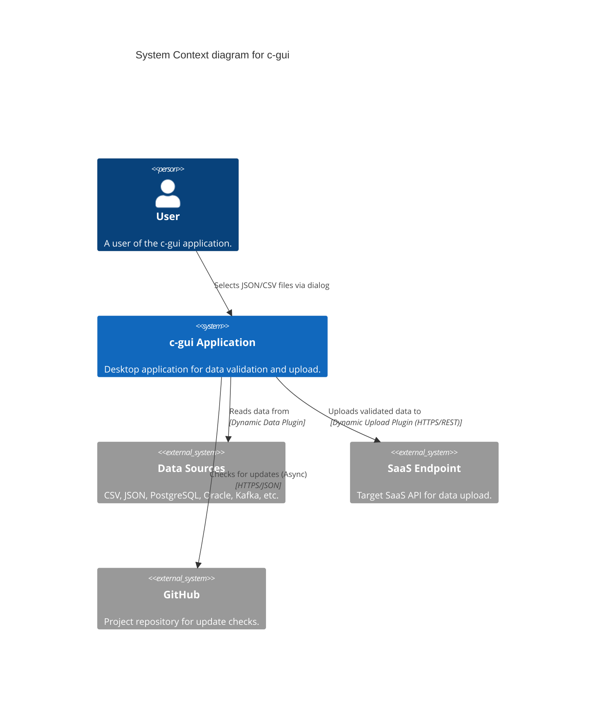
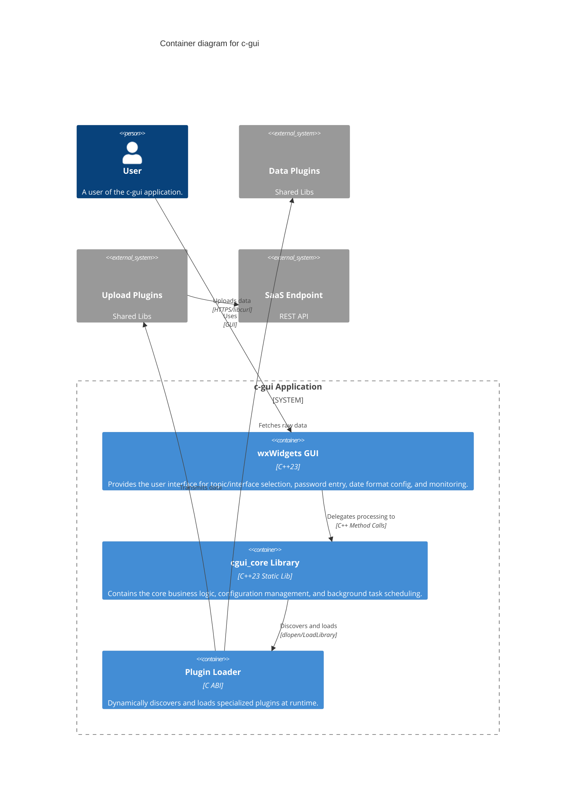
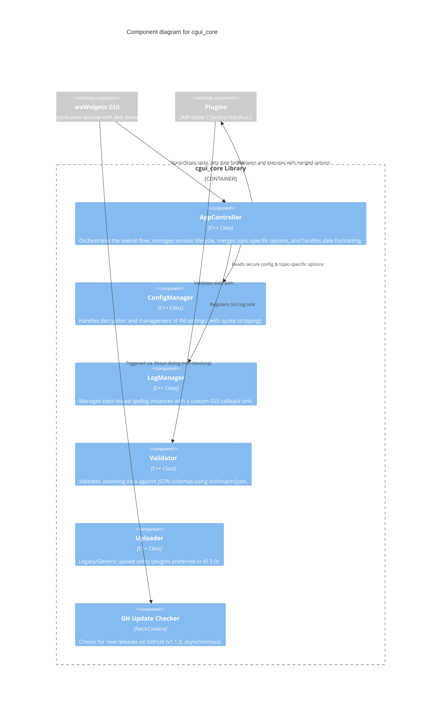

# c-gui Architecture Documentation

This document provides a comprehensive overview of the `c-gui` application architecture (v0.3.0). It uses the [C4 model](https://c4model.com/) to describe the system at various levels of abstraction.

## Overview

`c-gui` is a modern C++23 desktop application designed for secure data validation and upload to SaaS endpoints. The application is built with a strong emphasis on security, modularity, and responsiveness.

**Key Technologies:**
- **Language:** C++23
- **GUI:** wxWidgets
- **Security:** libsodium (XChaCha20-Poly1305 for encryption)
- **Networking:** libcurl
- **Data Handling:** nlohmann/json
- **Plugin System:** ABI-stable C interface with dynamic discovery
- **Update Checker:** GitHub API integration (v1.1.0, async)

---

## 1. Context Diagram

The Context diagram shows the `c-gui` application in its environment, illustrating its interactions with the user and external systems.

---

## 2. Container Diagram

The Container diagram breaks down the `c-gui` application into its major execution units (containers) and shows how they interact.

---

## 3. Component Diagram

The Component diagram zooms into the `cgui_core` library to show its internal structure and components.

---

## Key Architectural Decisions

### 1. Dual-Plugin Strategy (Mandatory)
To support diverse data sources and complex SaaS API handshakes, each topic MUST be split into two specialized plugins:
- **Data (Ingest) Plugins (`<topic>_<type>_input`):** Handle reading from specific sources (CSV, JSON, DB-Ora, DB-PG, Kafka) and converting to the internal JSON format.
- **Upload (Output) Plugins (`<topic>_upload`):** Handle topic-specific API handshakes, payload formatting (wrapping), and secure transmission.

### 2. Topic-Specific Payload Overrides (v0.3.0)
The application now supports overriding the upload payload options per topic via the INI file. The `AppController` merges global settings with `[topics.<TopicName>.options]` before initializing the upload plugin.

### 3. Flexible Date Formatting (v0.3.0)
The GUI allows users to select date component order and delimiters. These settings are synchronized with topic-specific INI defaults and passed to the upload plugin, which prioritizes them over hardcoded defaults.

### 4. Non-Blocking Update Checks (v1.1.0 Lib)
By utilizing the asynchronous API of the `gh-update-checker` library, update checks no longer freeze the UI thread, ensuring a modern and responsive user experience.

