# Screenshots

Overview of all screenshots in the **c-gui** project, sorted in ascending order.

---

| File | Description | Preview |
|---|---|---|
| `01.png` | Login | 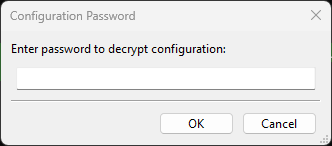 |
| `02.png` | Startscreen | 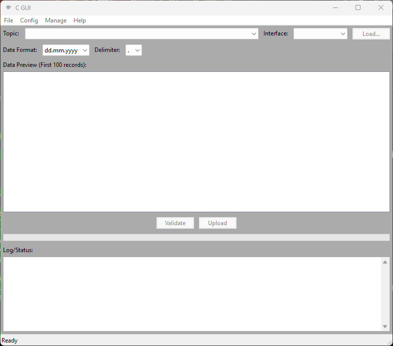 |
| `03.png` | About with update check | 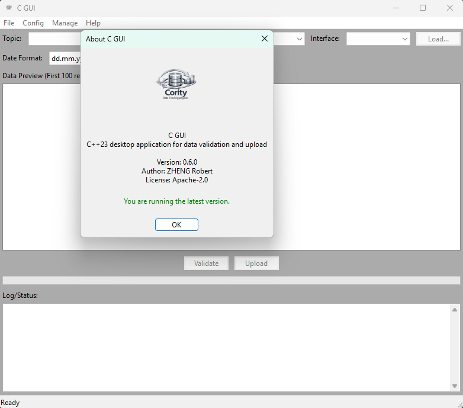 |
| `04.png` | Log signing | 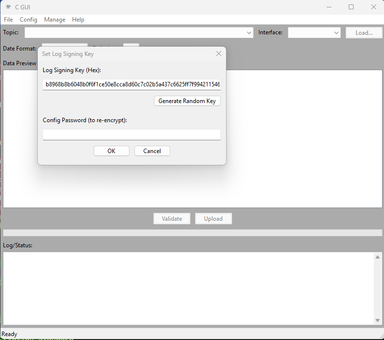 |
| `05.png` | Proxy settings | 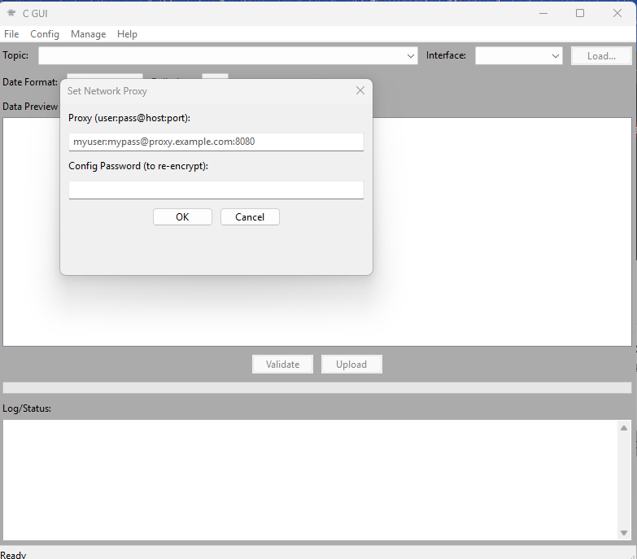 |
| `06.png` | some litte help | 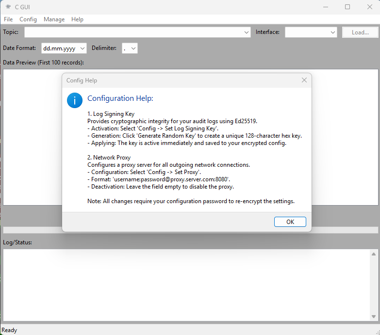 |
| `07.png` | registered plugins | 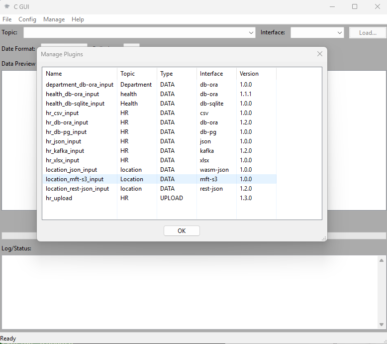 |
| `08.png` | Topic Manager | 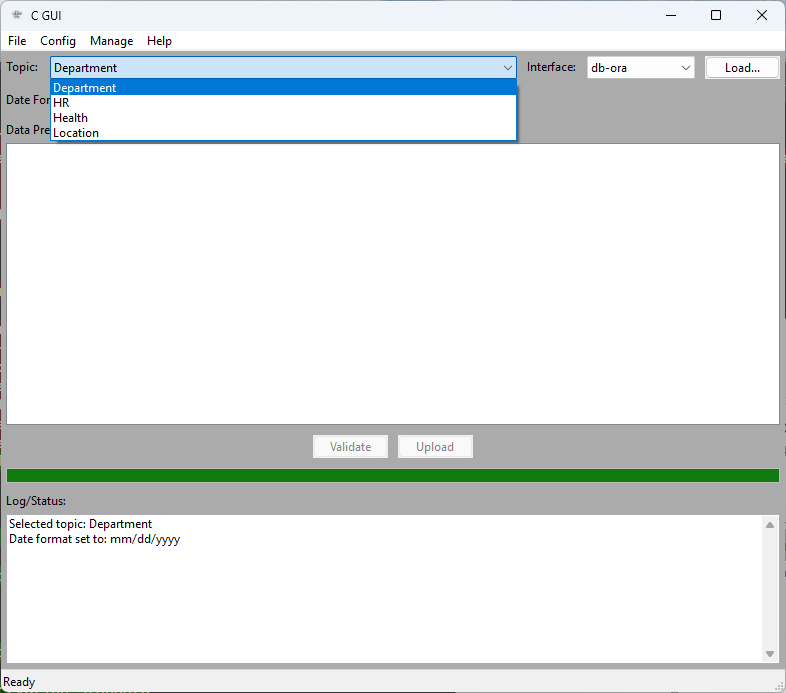 |
| `09.png` | per topic available data interfaces | 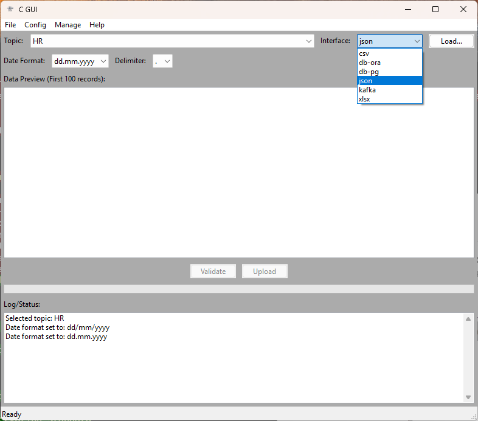 |
| `10.png` | loaded data with optional data preview | 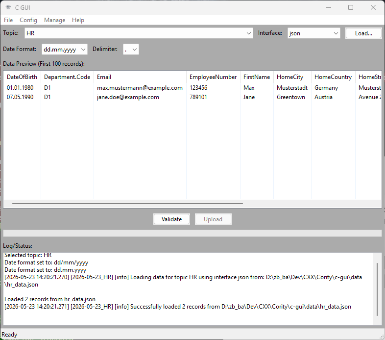 |
| `11.png` | Schema validation | 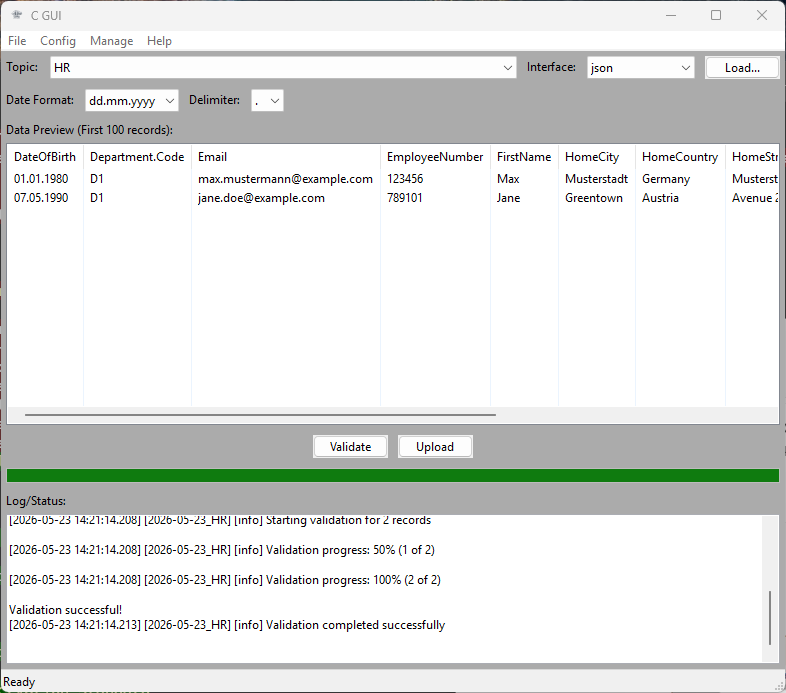 |
| `12a.png` | SaaS upload error | 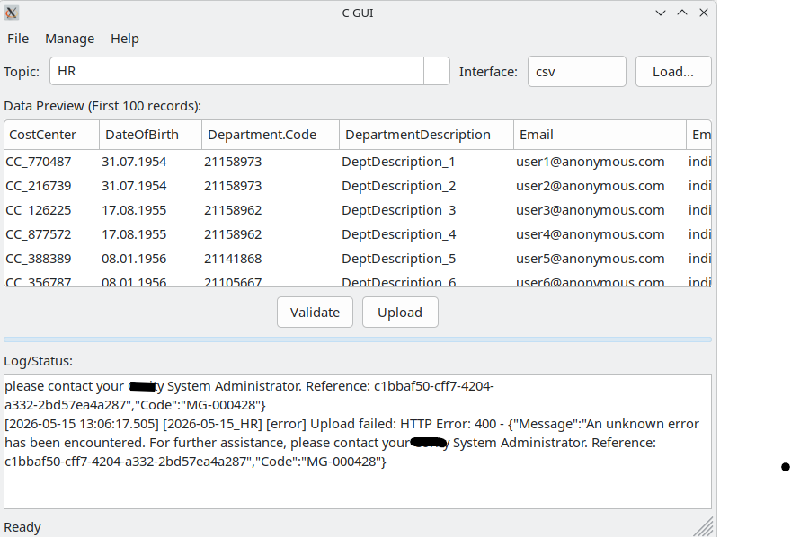 |
| `12b.png` | SaaS upload success | 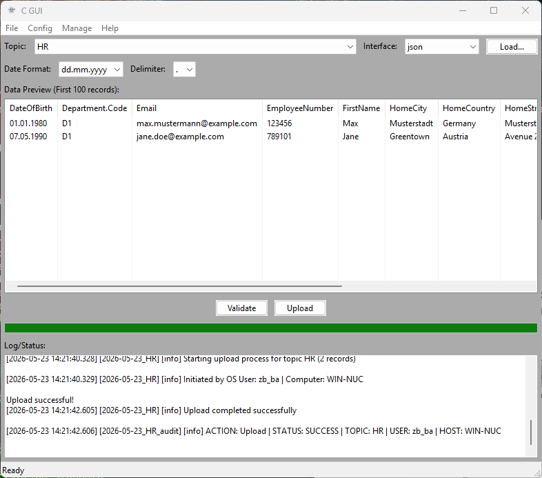 |
| `13.png` | Core logfile | 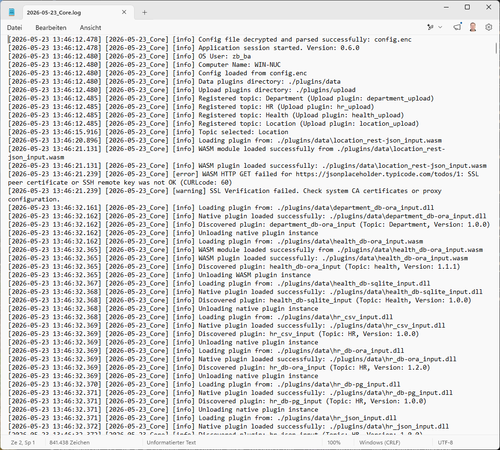 |
| `14.png` | topic logfile | 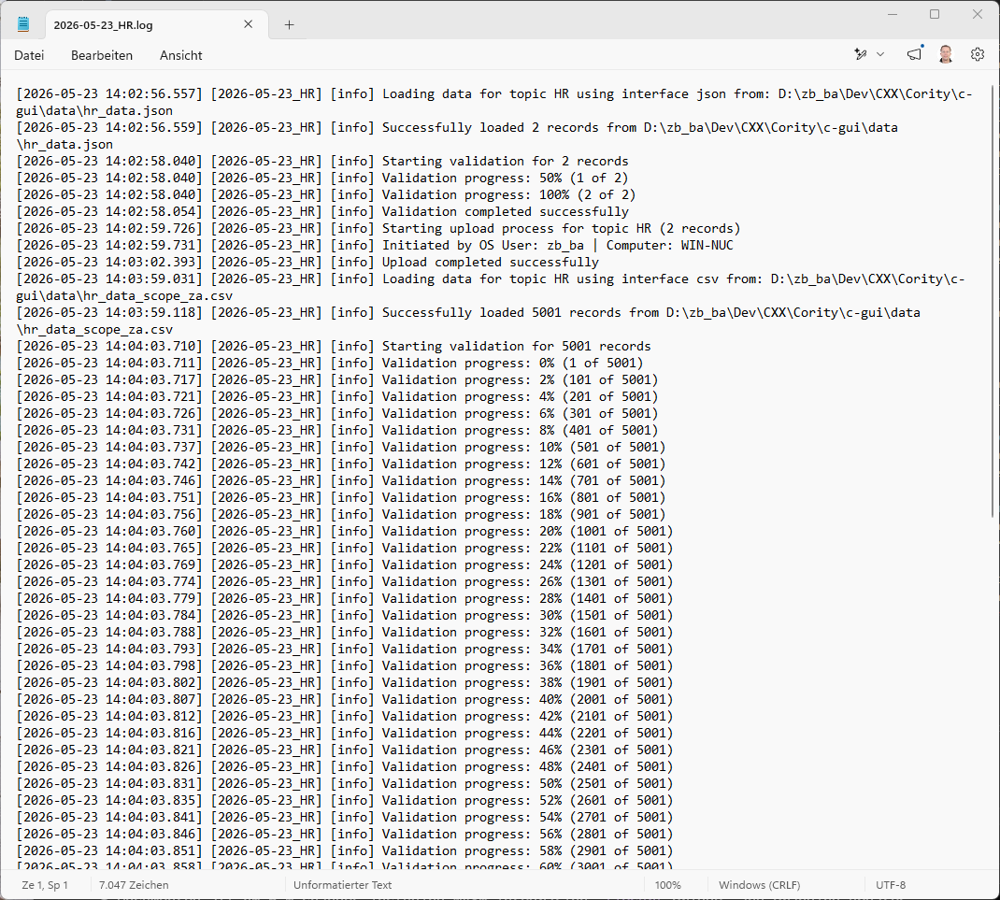 |
| `15.png` | signed topic logfile | 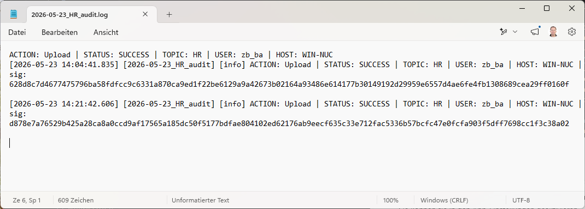 |
