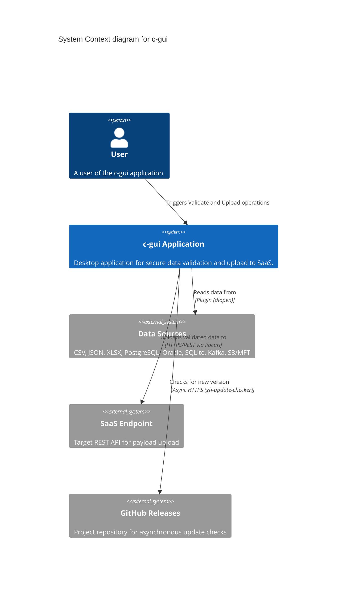

# Technical Documentation — System Overview

> **Project:** c-gui  
> **Version:** 0.5.0  
> **License:** Apache-2.0  
> **Author:** ZHENG Robert  
> **Repository:** <https://github.com/Zheng-Bote/c-gui>

---

## 1. Introduction

**c-gui** is a C++23 desktop application designed for secure data validation and upload to SaaS endpoints. It follows a **Dual-Plugin Architecture** where each data domain (topic) is handled by two specialized plugins: one for data ingestion (Input) and one for API integration (Upload).

The application provides an encrypted configuration system, JSON Schema validation, cryptographic audit log signing, background worker threads, and a wxWidgets-based graphical user interface.

### 1.1 Purpose

- Collect data from heterogeneous sources (CSV, JSON, XLSX, databases, Kafka, S3/MFT)
- Validate data against JSON Schemas at rest
- Upload validated data to SaaS REST endpoints with per-topic authentication
- Maintain non-repudiation via Ed25519-signed audit logs

### 1.2 Key Design Goals

| Goal | Implementation |
|------|---------------|
| Modular data ingestion | ABI-stable C plugin interface, dynamically loaded via dlopen/LoadLibrary |
| Strong security at rest | XChaCha20-Poly1305 + Argon2id for config encryption |
| Non-repudiation | Ed25519-signed audit logs via crypto_sign_detached |
| Responsive UI | Background worker threads (std::thread + wxWindow::CallAfter) |
| Dynamic discovery | Filesystem scan for plugin .so/.dll files at runtime |
| Cross-platform | CMake + Conan + platform-conditional code paths |

---

## 2. Technology Stack

| Component | Technology | Purpose |
|-----------|-----------|---------|
| Language | C++23 | std::expected, std::format, std::filesystem |
| GUI Framework | wxWidgets 3.2+ | Native desktop GUI (Win32 / GTK3 / macOS Cocoa) |
| Build System | CMake >= 3.28 | Meta-build with presets |
| Package Manager | Conan v2 | Third-party dependency resolution |
| JSON | nlohmann/json | Data interchange, config parsing |
| JSON Schema | valijson | Runtime schema validation |
| HTTP | libcurl | SaaS uploads, auth requests |
| Encryption | libsodium | XChaCha20-Poly1305, Argon2id, Ed25519 |
| Logging | spdlog | Rotating file logs, console sink, GUI callback sink |
| INI Parsing | inih (minIni) | Encrypted INI file parsing |
| Spreadsheets | OpenXLSX | XLSX input plugin |
| Databases | libpqxx | PostgreSQL input plugin |
| Messaging | librdkafka | Kafka input plugin (stub) |
| Testing | Catch2 v3 | Unit test framework |
| Update Checker | gh-update-checker (FetchContent) | Non-blocking GitHub release check |

---

## 3. High-Level Architecture

```
                         c-gui Application

   wxWidgets                    cgui_core (Static Lib)
   GUI (Frame)                --------------------------
   -----------                | AppController          |
   Topic Combo               |  +- ConfigManager      |
   Interface                 |  +- PluginLoader       |
   Date Format               |  +- TopicRegistry      |
   Preview                   |  +- SchemaManager      |
   Progress                  |  +- Validator          |
   Log/Status                |  +- Uploader           |
                             --------------------------
                                      |
                                      v
                     Plugin System (Shared Libraries)
   csv_input  json_input  db-pg_input  db-ora_input  kafka_input
   xlsx_input sqlite_input  s3_input   hr_upload  (per-topic upload)
```

---

## 4. System Context (C4 Level 1)



---

## 5. Directory Layout

```
c-gui/
  CMakeLists.txt               # Top-level build
  conanfile.py                 # Conan v2 recipe
  sample.ini                   # Plaintext configuration template
  config.enc                   # Encrypted configuration (generated)

  configure/
    CMakeLists.txt             # Config generation
    rz_config.hpp.in          # CMake @var@ template

  include/
    rz_config.hpp, PluginAPI.hpp, PluginLoader.hpp
    ConfigManager.hpp, AuthManager.hpp, LogManager.hpp
    TopicRegistry.hpp, SchemaManager.hpp, Validator.hpp, Uploader.hpp

  src/
    main.cpp                   # wxApp entry, password prompt
    AppController.hpp/cpp     # Central orchestrator
    MainWindow.hpp/cpp        # wxFrame with all UI controls
    ConfigManager.cpp, PluginLoader.cpp, AuthManager.cpp
    LogManager.cpp, TopicRegistry.cpp, SchemaManager.cpp
    Validator.cpp, Uploader.cpp, encrypt_tool.cpp

  plugins/
    CMakeLists.txt             # Output dir: build/plugins/
    hr_csv_input/              # Topic: HR, Interface: csv
    hr_json_input/             # Topic: HR, Interface: json
    hr_xlsx_input/             # Topic: HR, Interface: xlsx
    hr_db-pg_input/            # Topic: HR, Interface: db-pg
    hr_db-ora_input/           # Topic: HR, Interface: db-ora
    hr_kafka_input/            # Topic: HR, Interface: kafka (stub)
    department_db-ora_input/   # Topic: Department, Interface: db-ora
    health_db-sqlite_input/    # Topic: Health, Interface: db-sqlite
    location_mft-s3_input/     # Topic: Location, Interface: mft-s3
    hr_upload/                 # Topic: HR, Type: Upload

  data/
    hr_data.json, hr_data_scope_za.csv, hr_schema_v1.json
    hr_upload_example.json, uploader.py, prompt.md

  tests/
    CMakeLists.txt, dummy_plugin.cpp, test_main.cpp
    test_config_manager.cpp, test_plugin_loader.cpp
    test_uploader.cpp, test_validator.cpp

  docs/
    architecture/              # C4 architecture documentation
    technical/                 # This document set
    encrypt_tool_readme.md
```
