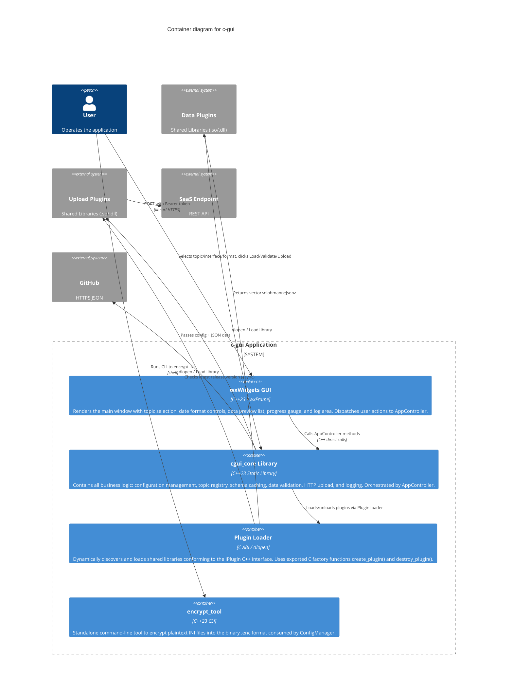
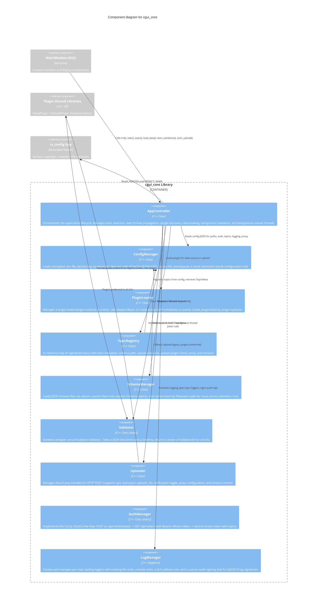
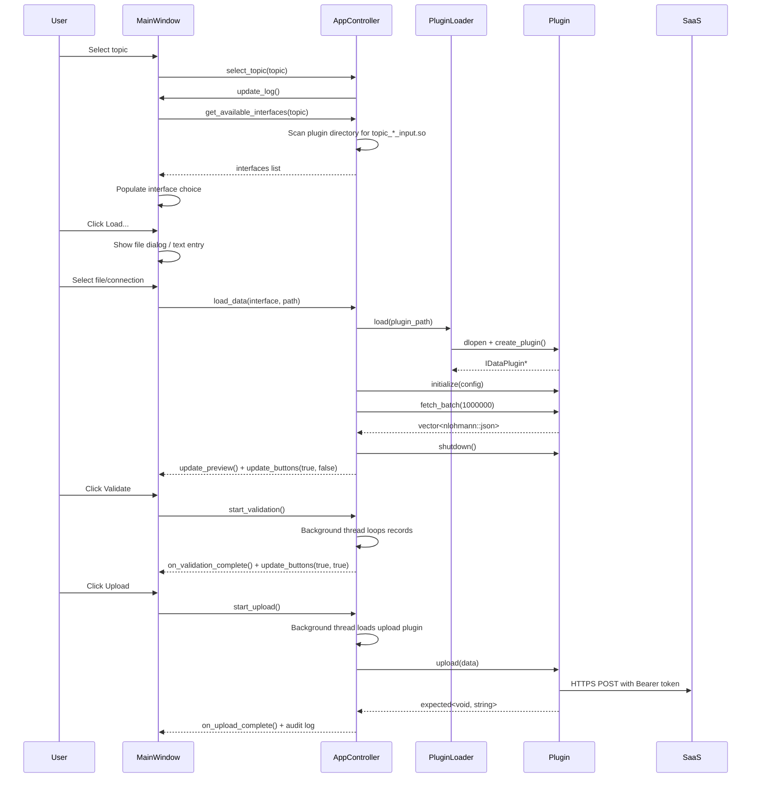

# Technical Documentation — C4 Container & Component Architecture

---

## 1. Container Diagram (C4 Level 2)

The application is decomposed into three primary execution units: the **wxWidgets GUI**, the **cgui_core static library**, and the **Plugin Loader** subsystem.



---

## 2. Component Diagram — cgui_core Library (C4 Level 3)



---

## 3. GUI Layout (MainWindow)

```
                     Menu Bar
   File              Manage            Help
   [Exit]           [Plugins...]       [About]

                     Top Bar
   [Topic: v]   [Interface: v]   [Load...]

                   Date Format Bar
   [Date Format: v]   [Delimiter: v]

                 Data Preview (wxListCtrl)
   First 100 records shown as table with dynamic columns

                   Button Bar
   [Validate]            [Upload]

                   Progress
   [==========wxGauge==========]

                   Log / Status (wxTextCtrl)
   Multi-line read-only log output
```

### 3.1 Event Flow



---

## 4. Threading Model

```
Main Thread (wx)
-----------------
wxApp::OnInit() -> CGuiApp
  - AppController::init()
  - MainWindow constructor (GUI controls)
  - wxEventLoop (event handlers)

Event handlers run here:
  - on_topic_selected
  - on_load_data      (blocking plugin call)
  - on_about          (detaches update check thread)
  - on_date_format_changed
  - on_manage_plugins (blocking scan)

GUI updates via CallAfter():
  - update_log()          - safe from any thread
  - update_progress()     - safe from any thread
  - update_preview()      - safe from any thread
  - update_buttons()      - safe from any thread


Background Thread: Validation
-------------------------------
std::thread([] { ... }).detach()
  - Iterates m_current_data[] records
  - Calls Validator::validate(record, schema)
  - Reports progress via CallAfter() every 100 records
  - Limits errors to 1000 for UI safety
  - Calls on_validation_complete() when done


Background Thread: Upload
-------------------------------
std::thread([] { ... }).detach()
  - Creates separate PluginLoader instance
  - Loads upload plugin (.so/.dll)
  - Merges topic-specific options from config
  - Calls IUploadPlugin::upload(data)
  - Plugin performs Cority auth flow internally
  - Calls on_upload_complete() when done
  - Audit log entry written (signed with Ed25519)


Background Thread: Update Check
----------------------------------
std::thread([] { ... }).detach()
  - Calls ghupdate::check_github_update_async()
  - Returns std::future<ghupdate::UpdateResult>
  - Shows About dialog with update info via CallAfter()
```

**Safety invariants:**
- m_current_data, m_preview_data, m_current_topic are mutated only from the main thread before background threads are spawned.
- Background threads read these values (copied vectors, not shared references) -- no mutex needed.
- GUI updates use CallAfter() which queues the lambda on the wx event loop.
- Each background thread loads its own PluginLoader instance for upload (separate dlopen).
