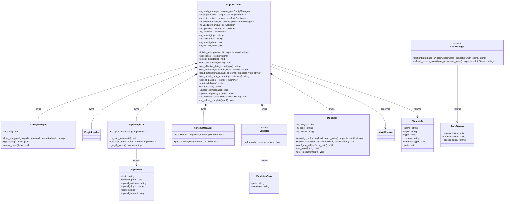
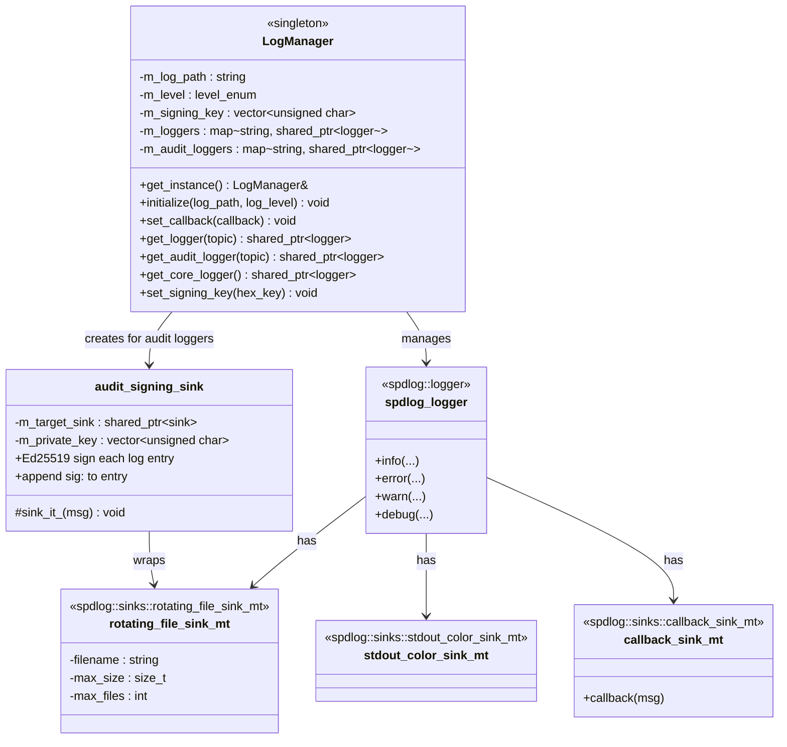
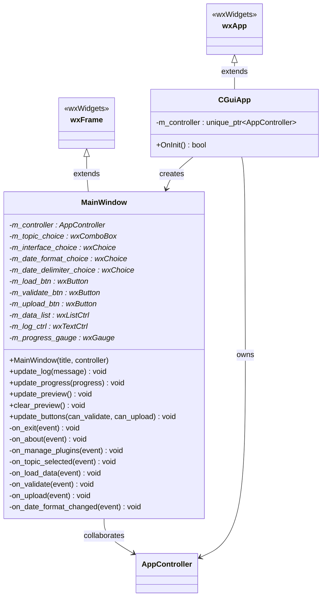

# Technical Documentation — UML Class Design

---

## 1. Plugin Interface Hierarchy

The plugin system is the central extensibility mechanism. All plugins implement the pure virtual `IPlugin` base interface and are further specialized into `IDataPlugin` and `IUploadPlugin`.

```mermaid
classDiagram
    class IPlugin {
        <<interface>>
        +initialize(json config) bool
        +get_topic() string
        +get_version() string
        +get_type() PluginType
        +shutdown() void
    }

    class IDataPlugin {
        <<interface>>
        +fetch_batch(size_t max_records) vector~json~
        +get_interface_type() string
        +get_type() PluginType
    }

    class IUploadPlugin {
        <<interface>>
        +upload(json data) expected~void, string~
        +get_type() PluginType
    }

    class PluginType {
        <<enumeration>>
        DATA
        UPLOAD
    }

    IPlugin <|-- IDataPlugin : extends
    IPlugin <|-- IUploadPlugin : extends
    IDataPlugin --> PluginType : returns
    IUploadPlugin --> PluginType : returns

    class PluginLoader {
        -m_handle : void*
        -m_plugin : IPlugin*
        -m_destroy_func : DestroyPluginFunc
        +load(path) expected~void, string~
        +unload() void
        +get_plugin() IPlugin*
    }

    PluginLoader --> IPlugin : owns

    class CsvInputPlugin {
        -m_file_path : string
        -m_headers : vector~string~
        -m_file : ifstream
        +initialize() bool
        +fetch_batch() vector~json~
        +get_interface_type() string
    }

    class HrJsonInputPlugin {
        -m_file_path : string
        -m_data : json
        -m_current_pos : size_t
        +initialize() bool
        +fetch_batch() vector~json~
    }

    class XlsxInputPlugin {
        -m_file_path : string
        -m_doc : unique_ptr~XLDocument~
        -m_current_row : uint32_t
        +initialize() bool
        +fetch_batch() vector~json~
    }

    class DbInputPlugin {
        -m_connection_string : string
        -m_connection : unique_ptr~pqxx::connection~
        +initialize() bool
        +fetch_batch() vector~json~
    }

    class HrDbOraInputPlugin {
        -m_connection_string : string
        +initialize() bool
        +fetch_batch() vector~json~
    }

    class KafkaInputPlugin {
        -m_initialized : bool
        +initialize() bool
        +fetch_batch() vector~json~
    }

    class HealthSqliteInputPlugin {
        -m_db_path : string
        +initialize() bool
        +fetch_batch() vector~json~
    }

    class DeptOraInputPlugin {
        -m_connection_string : string
        +initialize() bool
        +fetch_batch() vector~json~
    }

    class LocS3InputPlugin {
        -m_s3_bucket : string
        +initialize() bool
        +fetch_batch() vector~json~
    }

    class HrUploadPlugin {
        -m_config : json
        -m_base_url : string
        -m_refresh_token : string
        -m_access_token : string
        -m_access_expiry : time_point
        -m_proxy : string
        +initialize() bool
        +upload() expected~void, string~
        -ensure_authenticated() expected~void, string~
        -perform_refresh() expected~void, string~
        -fetch_access_token() expected~void, string~
    }

    IDataPlugin <|-- CsvInputPlugin : implements
    IDataPlugin <|-- HrJsonInputPlugin : implements
    IDataPlugin <|-- XlsxInputPlugin : implements
    IDataPlugin <|-- DbInputPlugin : implements
    IDataPlugin <|-- HrDbOraInputPlugin : implements
    IDataPlugin <|-- KafkaInputPlugin : implements
    IDataPlugin <|-- HealthSqliteInputPlugin : implements
    IDataPlugin <|-- DeptOraInputPlugin : implements
    IDataPlugin <|-- LocS3InputPlugin : implements
    IUploadPlugin <|-- HrUploadPlugin : implements
```

---

## 2. Core Library Classes

---

## 3. LogManager Architecture

---

## 4. MainWindow UI Class

