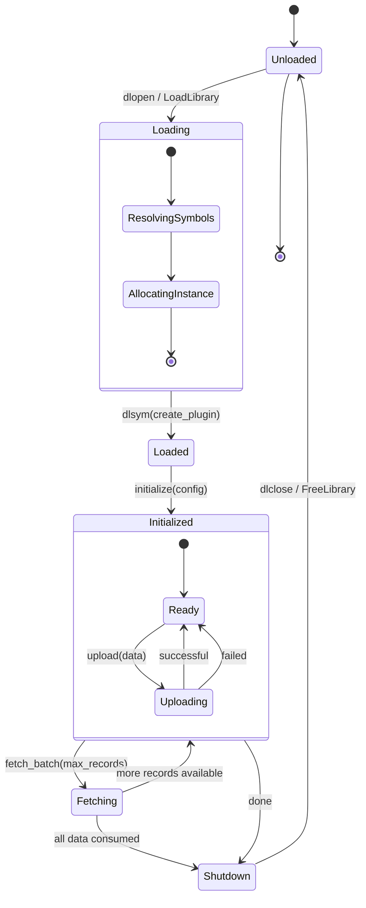
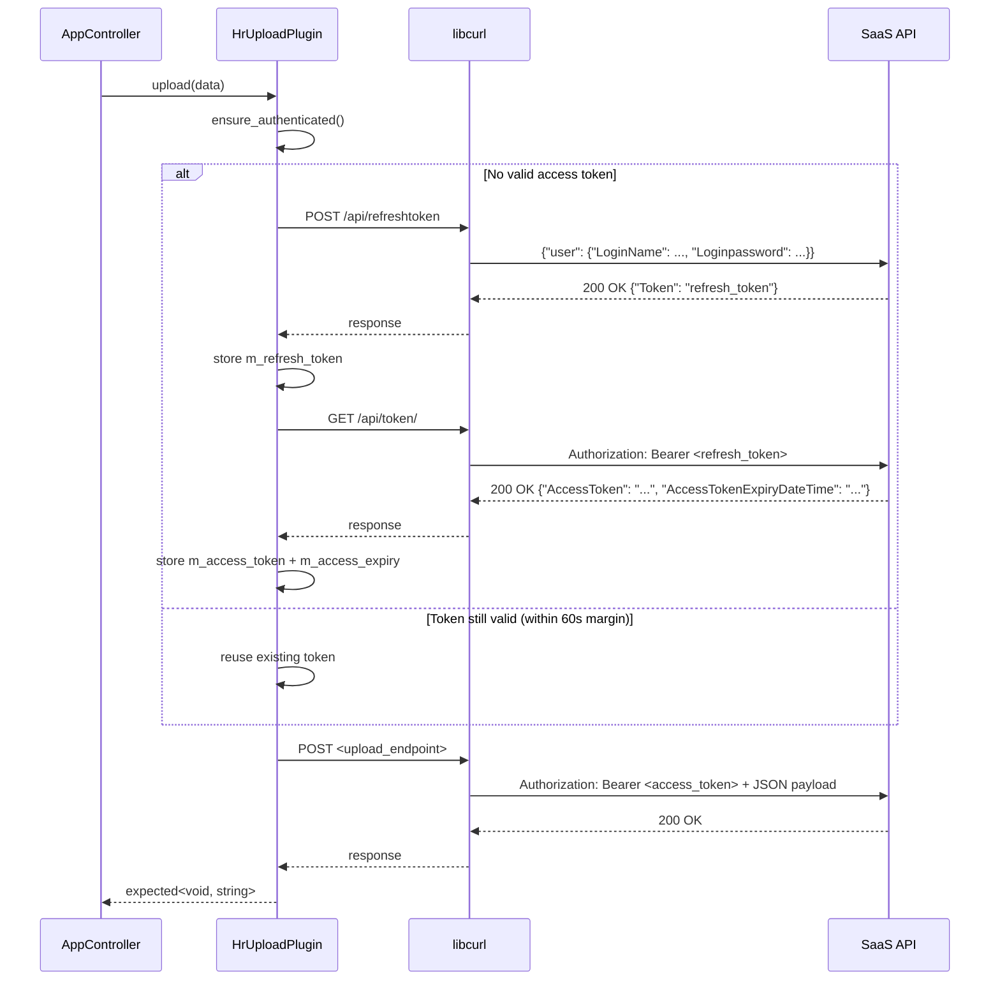

# Technical Documentation — Plugin System

---

## 1. Dual-Plugin Architecture

Every data topic (e.g., "HR", "Health", "Department", "Location") is handled by exactly **two** shared libraries:

| Plugin Role | Naming Convention | Interface | Responsibility |
|-------------|------------------|-----------|----------------|
| **Data/Ingest** | `<topic>_<interface>_input` (e.g. `hr_csv_input`) | `IDataPlugin` | Read raw data from a source, convert to JSON, return records |
| **Upload/Output** | `<topic>_upload` (e.g. `hr_upload`) | `IUploadPlugin` | Authenticate, format payload, POST to SaaS endpoint |

This separation enables:
- Multiple ingestion methods per topic (CSV **and** JSON **and** database for HR)
- Different upload behaviors per topic without affecting ingestion
- Independent development and testing of each plugin

---

## 2. Plugin Interface Definition

### Core Interface (`IPlugin`)

```cpp
class IPlugin {
public:
    virtual ~IPlugin() = default;
    virtual bool initialize(const nlohmann::json& config) = 0;
    virtual std::string get_topic() const = 0;
    virtual std::string get_version() const = 0;
    virtual PluginType get_type() const = 0;
    virtual void shutdown() = 0;
};
```

### Data Plugin Interface (`IDataPlugin`)

```cpp
class IDataPlugin : public IPlugin {
public:
    virtual std::vector<nlohmann::json> fetch_batch(size_t max_records) = 0;
    virtual std::string get_interface_type() const = 0;
    // get_type() returns PluginType::DATA
};
```

### Upload Plugin Interface (`IUploadPlugin`)

```cpp
class IUploadPlugin : public IPlugin {
public:
    virtual std::expected<void, std::string> upload(const nlohmann::json& data) = 0;
    // get_type() returns PluginType::UPLOAD
};
```

---

## 3. C ABI Factory Functions

Each plugin shared library must export exactly two `extern "C"` functions:

```cpp
extern "C" {
    CGUI_PLUGIN_EXPORT cgui::IPlugin* create_plugin();
    CGUI_PLUGIN_EXPORT void destroy_plugin(cgui::IPlugin* plugin);
}
```

`create_plugin()` returns a heap-alloced instance. `destroy_plugin()` calls `delete`.
The loader resolves these symbols via `dlsym()` (Linux) / `GetProcAddress()` (Windows).

---

## 4. Plugin Lifecycle



### Lifecycle Phases

1. **Load**: `PluginLoader::load(path)` opens the shared library (`dlopen`/`LoadLibrary`), resolves `create_plugin` and `destroy_plugin` symbols, calls `create_plugin()` to get an `IPlugin*`.

2. **Initialize**: `AppController` configures the plugin with a JSON object containing:
   - For data plugins: `file_path`, `connection_string`, `topic`
   - For upload plugins: full config tree, `topic`, `upload_endpoint`, `options`, `proxy`

3. **Execute**: 
   - Data: `fetch_batch(max_records)` — called once currently with `max_records=1000000` to load everything.
   - Upload: `upload(data)` — performs the full auth flow and HTTP POST.

4. **Shutdown**: `shutdown()` releases resources. The loader calls `destroy_plugin()` then `dlclose()`.

---

## 5. Plugin Discovery

Plugins are discovered dynamically by scanning filesystem directories matching the naming convention.

### Discovery Algorithm (in `AppController::get_all_plugins()`)

```
function get_all_plugins():
    plugins = []
    scan_dir(m_data_plugins_dir, PluginType::DATA)
    scan_dir(m_upload_plugins_dir, PluginType::UPLOAD)
    return plugins

function scan_dir(dir, expected_type):
    for each .so/.dll file in dir:
        loader = PluginLoader()
        if loader.load(file) succeeds:
            plugin = loader.get_plugin()
            if plugin.get_type() == expected_type:
                extract: name, topic, version, interface_type
                append to plugins
            plugin.shutdown()
```

### Interface Discovery (in `AppController::get_available_interfaces(topic)`)

```
function get_available_interfaces(topic):
    interfaces = []
    prefix = topic.lower + "_"
    suffix = "_input" + ext.lower
    for each file in m_data_plugins_dir:
        if file starts with prefix AND ends with suffix:
            interface = file[name without prefix and suffix]
            interfaces.append(interface)
    return interfaces
```

---

## 6. Plugin Inventory

| Plugin | Topic | Interface | Type | Version | Notes |
|--------|-------|-----------|------|---------|-------|
| `hr_csv_input` | HR | csv | DATA | 1.0.0 | Reads CSV files |
| `hr_json_input` | HR | json | DATA | 1.0.0 | Reads JSON arrays |
| `hr_xlsx_input` | HR | xlsx | DATA | 1.0.0 | Reads XLSX via OpenXLSX |
| `hr_db-pg_input` | HR | db-pg | DATA | 1.0.0 | PostgreSQL via libpqxx |
| `hr_db-ora_input` | HR | db-ora | DATA | 1.0.0 | Oracle DB |
| `hr_kafka_input` | HR | kafka | DATA | 1.0.0 | Kafka consumer (stub) |
| `health_db-sqlite_input` | Health | db-sqlite | DATA | 1.0.0 | SQLite via C API |
| `department_db-ora_input` | Department | db-ora | DATA | 1.0.0 | Oracle DB |
| `location_mft-s3_input` | Location | mft-s3 | DATA | 1.0.0 | S3 MFT (stub) |
| `hr_upload` | HR | upload | UPLOAD | 1.3.0 | Cority auth + POST |

---

## 7. hr_upload Plugin — Cority Authentication Flow

The `hr_upload` plugin is the most complex plugin. It implements a two-step OAuth2-like handshake:



**Token refresh logic** (`ensure_authenticated()`):
- If `m_access_token` is non-empty AND `now + 60s < m_access_expiry` → reuse token.
- Otherwise: re-authenticate from scratch (POST refresh + GET access token).

---

## 8. PluginLoader Implementation Details

```cpp
// Loading path on Linux:
m_handle = dlopen(path.c_str(), RTLD_LAZY);

// Symbol resolution:
auto create_func = dlsym(m_handle, "create_plugin");
m_destroy_func = dlsym(m_handle, "destroy_plugin");

// Instance creation:
m_plugin = create_func();

// Unloading:
m_destroy_func(m_plugin);
dlclose(m_handle);
```

Platform differences:

| Operation | Linux | Windows |
|-----------|-------|---------|
| Open library | `dlopen(path, RTLD_LAZY)` | `LoadLibraryW(path.wstring())` |
| Resolve symbol | `dlsym(handle, "name")` | `GetProcAddress(handle, "name")` |
| Close library | `dlclose(handle)` | `FreeLibrary(handle)` |
| Error info | `dlerror()` | `GetLastError()` |
| Library extension | `.so` | `.dll` |

The `m_plugin_loader` member in `AppController` is reused per operation (load → use → unload), so only one plugin is active at a time. Background upload threads create their own `PluginLoader` instance.
