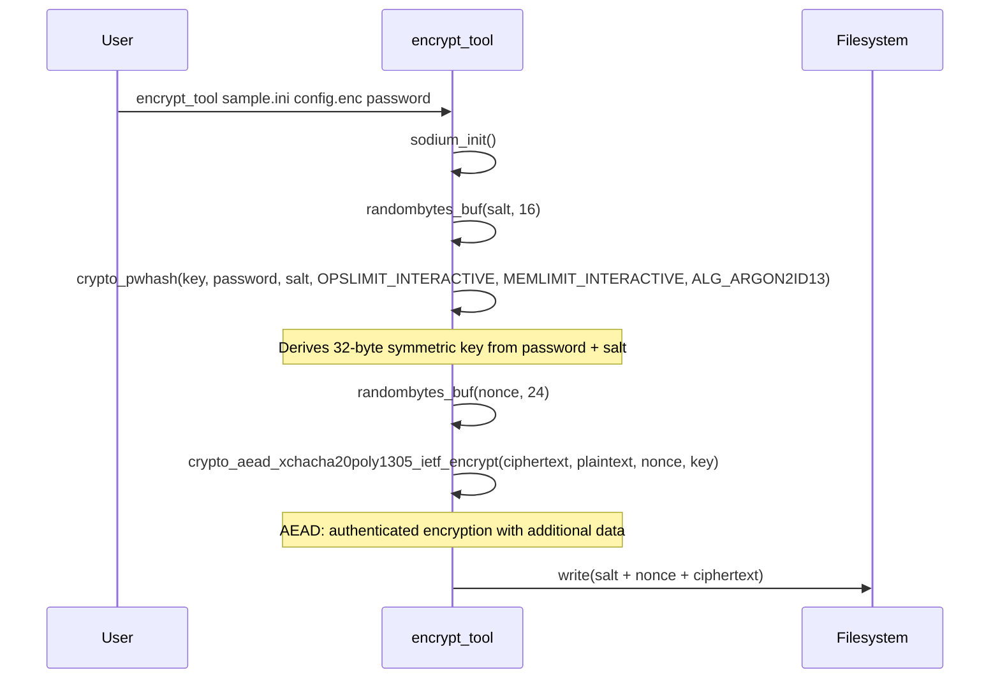
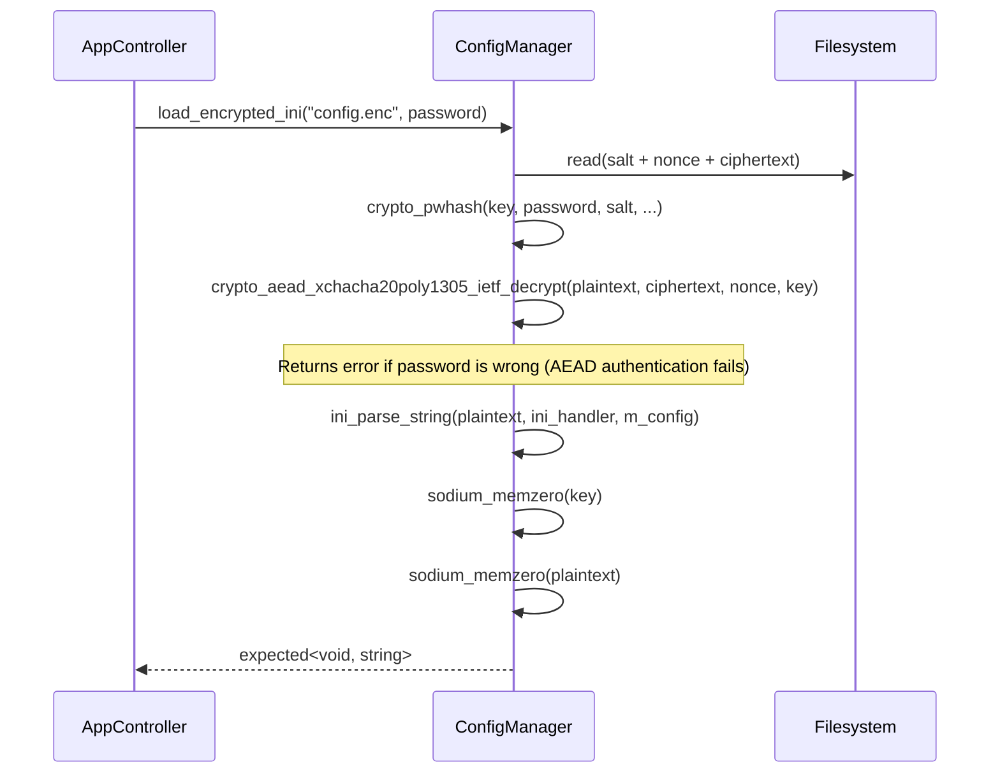
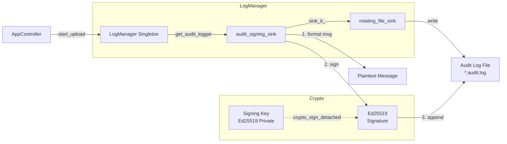
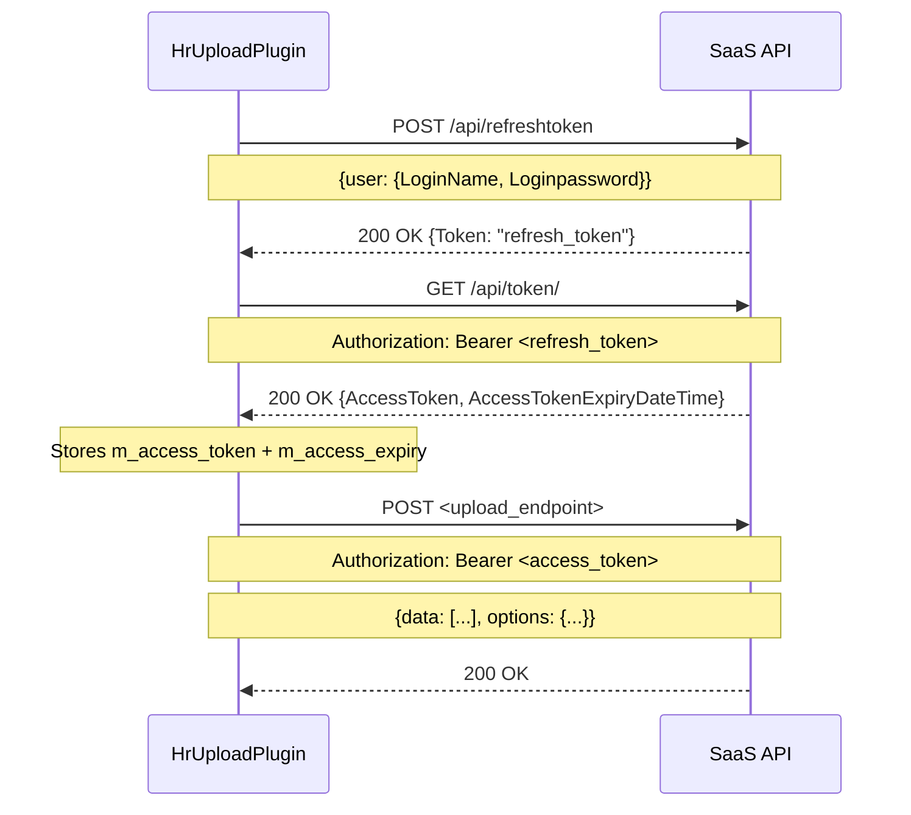

# Technical Documentation — Security Architecture

---

## 1. Overview

c-gui implements a three-layer security model:

```
 Layer 1: Configuration at Rest
   Encrypted INI file (.enc) using:
   - Argon2id (key derivation)
   - XChaCha20-Poly1305 (AEAD encryption)

 Layer 2: Data in Transit
   - HTTPS/TLS via libcurl
   - OAuth2 bearer tokens (SaaS authentication)
   - Global proxy support with credentials

 Layer 3: Audit Trail
   - Ed25519 digital signatures on audit logs
   - Non-repudiation for upload operations
```

---

## 2. Configuration Encryption

### 2.1 File Format

The encrypted configuration file (`config.enc`) has a binary layout:

```
+----------------------------+
| Salt (crypto_pwhash_SALTBYTES) |  16 bytes
+----------------------------+
| Nonce (crypto_aead_...)    |  24 bytes
+----------------------------+
| Ciphertext                 |  variable
|   (AEAD encrypted INI)     |
+----------------------------+
```

### 2.2 Encryption Flow



### 2.3 Decryption Flow



### 2.4 Key Parameters

| Parameter | Value |
|-----------|-------|
| Key derivation algorithm | Argon2id (`crypto_pwhash_ALG_ARGON2ID13`) |
| Ops limit | `crypto_pwhash_OPSLIMIT_INTERACTIVE` |
| Mem limit | `crypto_pwhash_MEMLIMIT_INTERACTIVE` |
| Symmetric cipher | XChaCha20-Poly1305 (`crypto_aead_xchacha20poly1305_ietf`) |
| Key size | 32 bytes (256 bits) |
| Nonce size | 24 bytes (192 bits) |
| Salt size | 16 bytes (128 bits) |
| Password env var | `cgui_config` (fallback) |

### 2.5 INI Structure (after decryption)

```ini
[networking]
proxy = "user:pass@proxy:8080"

[paths]
data_plugins_dir = ./plugins/data
upload_plugins_dir = ./plugins/upload

[auth]
saas_base_url = https://saas.example.com
saas_login = saas_user
saas_password = secret
verify_ssl = true

[logging]
log_path = ./logs
log_level = debug

[gui]
show_preview = true
only_default_datasource = false

[topics.HR]
schema_path = ./data/hr_schema_v1.json
upload_endpoint = https://saas.example.com/api/employeeimport
data_csv = "./data/hr_data.csv"

[topics.HR.options]
dateFormat = "dd.mm.yyyy"
updateExistingRecords = "true"
```

**Security note:** The decrypted config is held in memory as a `nlohmann::json` object. The plaintext INI string and derived key are zeroed via `sodium_memzero()` after parsing. The JSON object itself is not explicitly zeroed on destruction (C++ `nlohmann::json` does not provide secure erase), but the class destructor calls `m_config.clear()`.

---

## 3. Audit Log Signing

### 3.1 Architecture



### 3.2 Signing Process

In the `audit_signing_sink` template class:

```cpp
void sink_it_(const spdlog::details::log_msg& msg) override {
    // 1. Format the message using spdlog formatter
    spdlog::memory_buf_t formatted;
    this->formatter_->format(msg, formatted);
    std::string text = fmt::to_string(formatted);
    
    // Strip trailing newline for signing consistency
    if (!text.empty() && text.back() == '\n') text.pop_back();
    if (!text.empty() && text.back() == '\r') text.pop_back();

    // 2. Sign with Ed25519
    unsigned char sig[crypto_sign_BYTES];  // 64 bytes
    crypto_sign_detached(sig, nullptr,
        reinterpret_cast<const unsigned char*>(text.c_str()),
        text.length(),
        m_private_key.data());

    // 3. Convert signature to hex
    char sig_hex[crypto_sign_BYTES * 2 + 1];
    sodium_bin2hex(sig_hex, sizeof(sig_hex), sig, sizeof(sig));

    // 4. Append signature to log line
    std::string signed_text = text + " | sig: " + sig_hex + "\n";
    
    // 5. Write to disk
    spdlog::details::log_msg signed_msg(...);
    m_target_sink->log(signed_msg);
}
```

### 3.3 Audit Log Entry Format

```
[2026-05-20 14:30:00.123] [2026-05-20_HR_audit] [info]
SUCCESS: Upload of topic HR completed.
OS User: zb_bamboo | Computer: devbox
 | sig: a1b2c3d4e5f6... (128 hex chars)
```

### 3.4 Verification

An external verifier would:
1. Strip the ` | sig: <hex>` suffix
2. Recover the plaintext message
3. Verify using the corresponding Ed25519 public key:
   ```c
   crypto_sign_verify_detached(sig, message, message_len, public_key);
   ```

The private key is configured via the INI `[security].log_signing_key` setting (hex-encoded Ed25519 seed).

---

## 4. SaaS Authentication (hr_upload)

The `hr_upload` plugin implements a two-step token exchange:



**Token expiry handling:**
- Access tokens are cached with a 60-second safety margin.
- If `now + 60s >= m_access_expiry`, the plugin re-authenticates.
- Credentials come from the encrypted INI `[auth]` section.

---

## 5. Network Security

- **HTTPS/TLS**: All uploads use libcurl with optional SSL verification.
- **Proxy support**: Global proxy from `[networking].proxy`, overridable per-topic in `[topics.<name>].proxy`.
- **SSL CA path**: Custom CA bundle path via `[auth].ssl_ca_path`.
- **Bypass mode**: `verify_ssl = false` disables peer verification (development only).
- **Timeout**: Default 60s upload timeout, configurable per-topic.

---

## 6. Memory Security

| Data | Protection |
|------|-----------|
| Decryption password | Passed as `std::string`, zeroed with `sodium_memzero` after use in ConfigManager |
| Derived symmetric key | Stored in `std::vector<unsigned char>`, zeroed with `sodium_memzero` after decryption |
| Plaintext INI content | `std::string`, zeroed with `sodium_memzero` after parsing |
| Configuration JSON | Cleared via `nlohmann::json::clear()` in destructor (no explicit zeroing) |
| SaaS passwords/tokens | Stored in `std::string` in plugin objects; cleared on shutdown |
