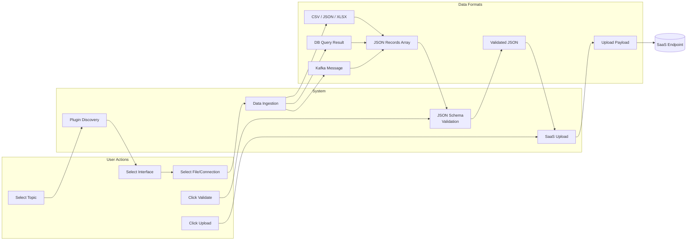
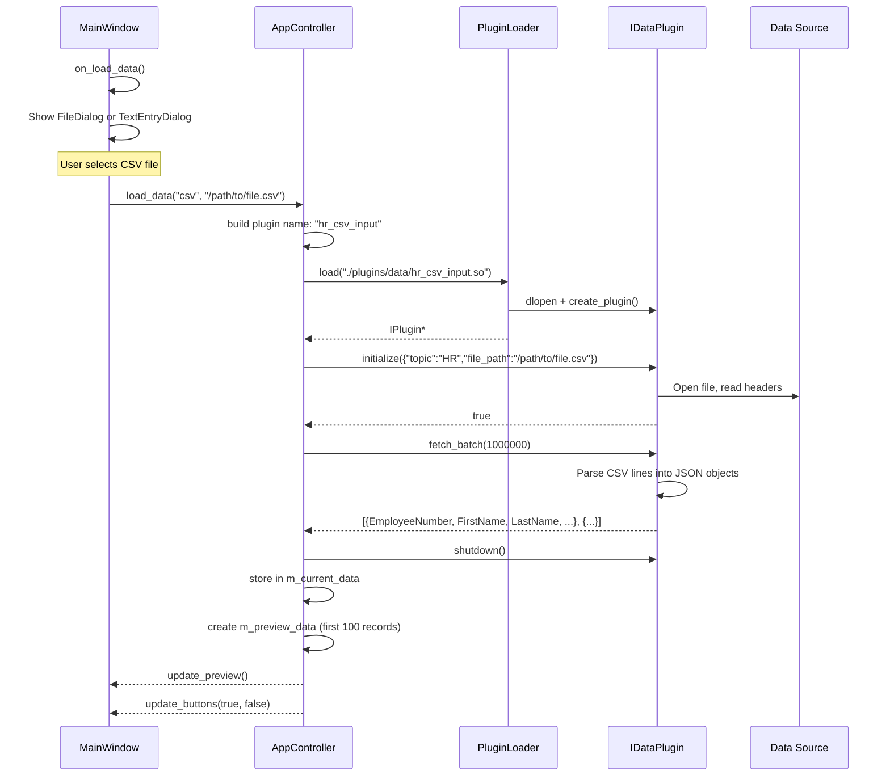
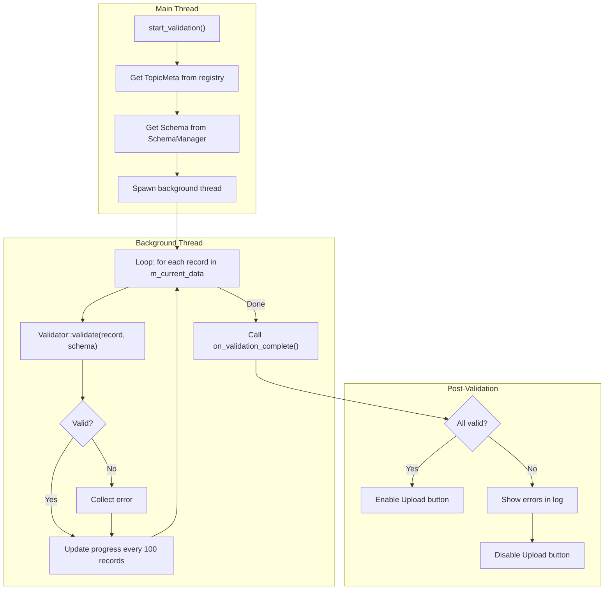
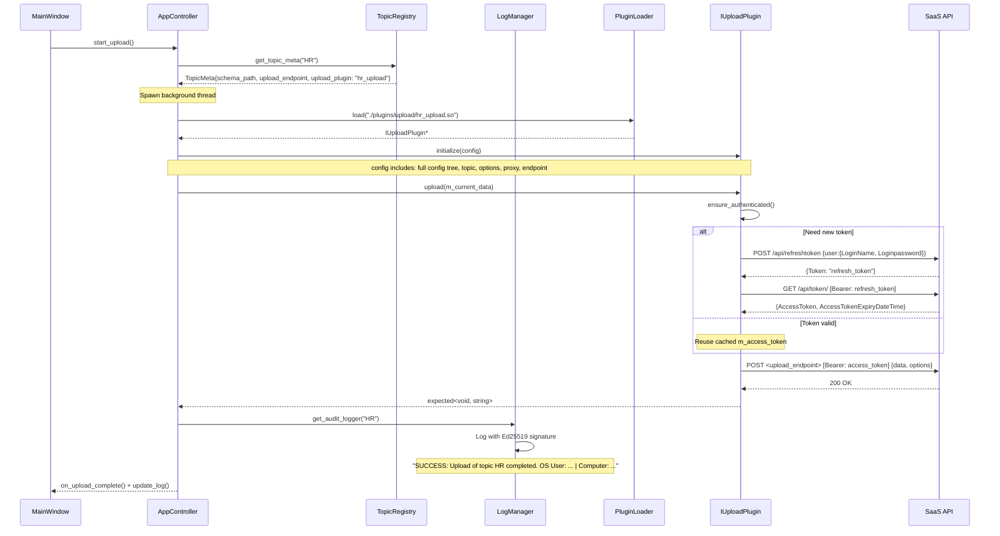
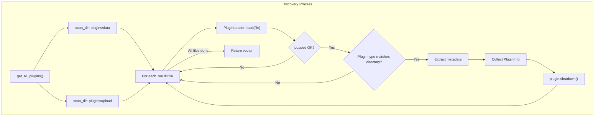

# Technical Documentation — Data Flow

---

## 1. End-to-End Data Flow



---

## 2. Data Ingestion Pipeline



### 2.1 Plugin-Native Data Formats

Each data plugin converts its source to the common internal format: `std::vector<nlohmann::json>` where each element is a JSON object with string-valued fields.

| Plugin | Source Format | Internal Conversion |
|--------|-------------|-------------------|
| CSV | `file.csv` | Parse lines by comma, first line as headers |
| JSON | `file.json` | Parse as `nlohmann::json`, expect array of objects |
| XLSX | `file.xlsx` | OpenXLSX row iterator, first row as headers |
| PostgreSQL | libpqxx query result | Column names as keys, row values as strings |
| Oracle | connection string | Abstraction layer (future) |
| SQLite | file path | SQLite C API (future) |
| Kafka | broker + topic | librdkafka consumer (stub) |
| S3/MFT | S3 bucket path | Stub |

---

## 3. Validation Pipeline



### 3.1 Schema Validation Details

- The JSON Schema is loaded once and cached in `SchemaManager` (keyed by path).
- `valijson::SchemaParser::populateSchema()` converts the JSON Schema into the runtime representation.
- Each record is validated independently via `valijson::Validator::validate()`.
- Errors are limited to 1000 to avoid overwhelming the UI log.
- Progress is reported via `CallAfter()` every 100 records.

### 3.2 Sample Schema (HR)

```json
{
  "type": "object",
  "properties": {
    "EmployeeNumber": { "type": "string", "pattern": "^[0-9]{6,8}$" },
    "FirstName": { "type": "string", "minLength": 2, "maxLength": 255 },
    "LastName": { "type": "string", "minLength": 2, "maxLength": 255 },
    "DateOfBirth": { "type": "string", "pattern": "^\\d{2}\\.\\d{2}\\.\\d{4}$" },
    "Email": { "type": "string" }
  },
  "required": ["EmployeeNumber", "FirstName", "LastName"]
}
```

### 3.3 ValidationError Struct

```cpp
struct ValidationError {
    std::string path;     // e.g., "[Record 5] /FirstName"
    std::string message;  // e.g., "value is less than minimum length of 2"
};
```

---

## 4. Upload Pipeline



### 4.1 Payload Merging (Topic-Specific Options)

```cpp
// In AppController::start_upload() background thread:
nlohmann::json plugin_config = config;  // full config tree
plugin_config["topic"] = m_current_topic;
plugin_config["upload_endpoint"] = meta->upload_endpoint;
plugin_config["options"]["dateFormat"] = m_date_format;

// Merge topic-specific overrides
if (config["topics"][m_current_topic]["options"].is_object()) {
    for (auto& [key, value] : config["topics"][m_current_topic]["options"].items()) {
        plugin_config["options"][key] = value;
    }
}
```

This allows per-topic settings like:
```ini
[topics.HR.options]
updateExistingRecords = "true"
insertBaseTables = "false"
autoCreatePortalUser = "false"
dateFormat = "dd.mm.yyyy"
```

---

## 5. Plugin Metadata Discovery Flow

Used for the "Manage Plugins" dialog.


