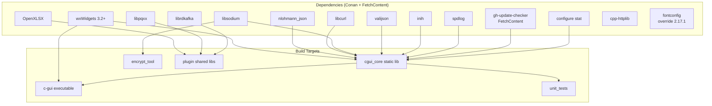

# Technical Documentation — Build System & Deployment

---

## 1. Build System Overview

c-gui uses **CMake >= 3.28** as its meta-build system with **Conan v2** for dependency management. The build produces three primary artifacts:

| Artifact | Type | Location |
|----------|------|----------|
| `c-gui` | Executable | `${BINARY_DIR}/bin/c-gui` |
| `encrypt_tool` | Executable | `${BINARY_DIR}/bin/encrypt_tool` |
| `cgui_core` | Static Library | `${BINARY_DIR}/lib/libcgui_core.a` |
| Plugin .so/.dll files | Shared Libraries | `${BINARY_DIR}/plugins/*.so` |
| `unit_tests` | Executable | `${BINARY_DIR}/tests/unit_tests` |

### 1.1 Build Graph



---

## 2. Conan Recipe

The `conanfile.py` declares all external dependencies:

```python
class CGuiRecipe(ConanFile):
    name = "c-gui"
    version = "0.5.0"
    package_type = "application"

    def requirements(self):
        self.requires("wxwidgets/[>=3.3 <4]")
        self.requires("nlohmann_json/[>=3.12 <4]")
        self.requires("libcurl/[>=8.20 <9]")
        self.requires("libsodium/[>=1.0.21 <2]")
        self.requires("valijson/[>=1.1 <2]")
        self.requires("libpqxx/[>=8.0 <9]")
        self.requires("librdkafka/[>=2.14 <3]")
        self.requires("inih/[>=62]")
        self.requires("spdlog/[>=1.15 <2]")
        self.requires("catch2/[>=3.14 <4]")
        self.requires("cpp-httplib/[>=0.44 <1]")
        self.requires("openxlsx/[>=0.4 <1]")

    def configure(self):
        self.options["cpp-httplib"].with_openssl = True
        self.options["wxwidgets"].shared = True
```

Dependencies are installed via:

```bash
conan install . --output-folder=build --build=missing
```

This generates CMake config files (`CMakeDeps`, `CMakeToolchain`) in the build folder.

---

## 3. CMake Structure

### 3.1 Top-Level CMakeLists.txt

```
CMakeLists.txt (top)
  |
  +-- configure/CMakeLists.txt    # rz_config.hpp.in -> include/rz_config.hpp
  +-- src/CMakeLists.txt           # cgui_core static lib + c-gui + encrypt_tool
  +-- plugins/CMakeLists.txt       # All plugin shared libraries
  |     +-- hr_csv_input/
  |     +-- hr_json_input/
  |     +-- hr_xlsx_input/
  |     +-- hr_db-pg_input/
  |     +-- hr_db-ora_input/
  |     +-- hr_kafka_input/
  |     +-- health_db-sqlite_input/
  |     +-- department_db-ora_input/
  |     +-- location_mft-s3_input/
  |     +-- hr_upload/
  +-- tests/CMakeLists.txt         # unit_tests + dummy_plugin
```

### 3.2 Key CMake Features

**C++ Standard:**
```cmake
set(CMAKE_CXX_STANDARD 23)
set(CMAKE_CXX_STANDARD_REQUIRED ON)
set(CMAKE_CXX_EXTENSIONS OFF)
set(CMAKE_EXPORT_COMPILE_COMMANDS ON)
```

**Output Directories:**
```cmake
set(CMAKE_RUNTIME_OUTPUT_DIRECTORY ${CMAKE_BINARY_DIR}/bin)
set(CMAKE_LIBRARY_OUTPUT_DIRECTORY ${CMAKE_BINARY_DIR}/bin)
set(CMAKE_ARCHIVE_OUTPUT_DIRECTORY ${CMAKE_BINARY_DIR}/lib)
```

Plugins override `CMAKE_LIBRARY_OUTPUT_DIRECTORY` to `build/plugins/`.

**FetchContent for gh-update-checker:**
```cmake
FetchContent_Declare(
  gh_update_checker
  GIT_REPOSITORY https://github.com/Zheng-Bote/gh-update-checker.git
  GIT_TAG        v1.2.0
)
FetchContent_MakeAvailable(gh_update_checker)
```

**Compiler Warnings:**
```cmake
if(MSVC)
    add_compile_options(/W4 /WX /permissive-)
else()
    add_compile_options(-Wall -Wextra -Wpedantic -Werror)
endif()
```

**Linux RPATH:**
```cmake
set(CMAKE_INSTALL_RPATH "$ORIGIN")
set(CMAKE_EXE_LINKER_FLAGS "${CMAKE_EXE_LINKER_FLAGS} -Wl,--disable-new-dtags")
```

### 3.3 src/CMakeLists.txt (cgui_core + executables)

```
cgui_core STATIC LIBRARY:
  Sources: AppController, MainWindow, ConfigManager, LogManager,
           AuthManager, PluginLoader, TopicRegistry, SchemaManager,
           Validator, Uploader
  Links: wxWidgets, nlohmann_json, libcurl, libsodium, valijson,
         inih, spdlog, gh_update_checker

c-gui EXECUTABLE:
  Sources: main.cpp
  Links: cgui_core

encrypt_tool EXECUTABLE:
  Sources: encrypt_tool.cpp
  Links: libsodium
```

---

## 4. CMake Presets

```json
// CMakeUserPresets.json (user-specific)
{
  "version": 6,
  "configurePresets": [
    {
      "name": "conan-release",
      "generator": "Ninja",
      "binaryDir": "${sourceDir}/build",
      "cacheVariables": {
        "CMAKE_BUILD_TYPE": "Release",
        "CMAKE_TOOLCHAIN_FILE": "${sourceDir}/build/build/Release/generators/conan_toolchain.cmake"
      }
    },
    {
      "name": "conan-default",
      "generator": "Visual Studio 17 2022",
      "binaryDir": "${sourceDir}/build",
      "cacheVariables": {
        "CMAKE_TOOLCHAIN_FILE": "${sourceDir}/build/build/generators/conan_toolchain.cmake"
      }
    }
  ],
  "buildPresets": [
    { "name": "conan-release", "configurePreset": "conan-release" },
    { "name": "conan-default", "configurePreset": "conan-default" }
  ]
}
```

---

## 5. Build Instructions

### Linux

```bash
# 1. Install Conan dependencies
conan install . --output-folder=build --build=missing

# 2. Configure with CMake preset
cmake --preset conan-release

# 3. Build
cmake --build --preset conan-release -j $(nproc)

# 4 (optional). Test
cd build && ctest --output-on-failure
```

### Windows

```powershell
# 1. Install Conan dependencies
conan install . --output-folder=build --build=missing

# 2. Configure
cmake --preset conan-default

# 3. Build
cmake --build --preset conan-default -j 8
```

---

## 6. CI/CD (GitHub Actions)

The `.github/workflows/ci.yml` workflow runs:

```yaml
jobs:
  build:
    strategy:
      matrix:
        os: [ubuntu-latest, windows-latest]

    steps:
      - uses: actions/checkout@v4
      - uses: seanmiddleditch/gha-setup-ninja@v5
      - name: Setup Conan
        run: pip install conan
      - name: Install deps
        run: conan install . --output-folder=build --build=missing
      - name: Configure
        run: cmake --preset conan-${{ matrix.os == 'ubuntu-latest' && 'release' || 'default' }}
      - name: Build
        run: cmake --build --preset conan-${{ matrix.os == 'ubuntu-latest' && 'release' || 'default' }} -j 2
      - name: Test
        run: ctest --test-dir build --output-on-failure
```

---

## 7. Output Layout

After a successful build, the `build/` directory contains:

```
build/
  bin/
    c-gui                      # Main executable
    encrypt_tool               # CLI encryption tool
    *.so / *.dll               # wxWidgets and other shared libs
  lib/
    libcgui_core.a             # Static library
  plugins/
    hr_csv_input.so
    hr_json_input.so
    hr_db-pg_input.so
    hr_db-ora_input.so
    hr_kafka_input.so
    hr_xlsx_input.so
    hr_upload.so
    health_db-sqlite_input.so
    department_db-ora_input.so
    location_mft-s3_input.so
  tests/
    unit_tests                 # Catch2 test executable
    libdummy_plugin.so         # Test plugin
```

---

## 8. Configuration Generation

The `configure/CMakeLists.txt` uses `configure_file()` to process `rz_config.hpp.in` into `include/rz_config.hpp`:

```cmake
configure_file(
    "rz_config.hpp.in"
    "${PROJECT_SOURCE_DIR}/include/rz_config.hpp"
    ESCAPE_QUOTES @ONLY)
```

The template replaces `@VAR@` placeholders with CMake variables:
- `@PROJECT_VERSION@`, `@PROJECT_VERSION_MAJOR@`, etc.
- `@CMAKE_CXX_COMPILER_ID@`, `@CMAKE_CXX_COMPILER_VERSION@`
- `@PROG_AUTHOR@`, `@PROG_LICENSE@`, `@PROG_ORGANIZATION_DOMAIN@`

The generated header exposes these as `constexpr std::string_view` values in `rz::config` namespace.
